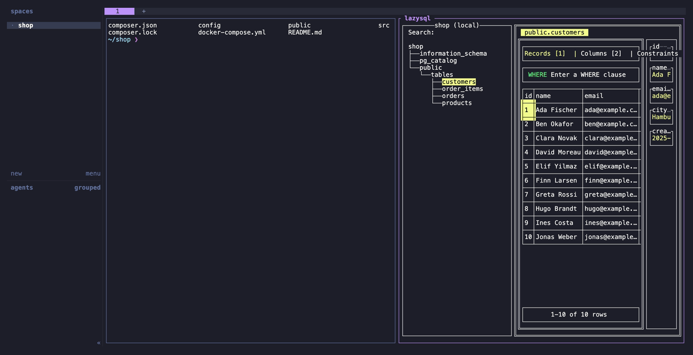
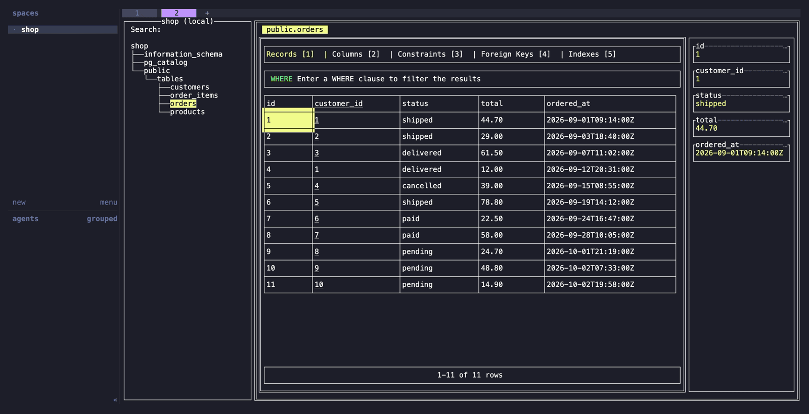

# herdr-lazysql

Run [lazysql](https://github.com/jorgerojas26/lazysql), a TUI database client, in a [herdr](https://herdr.dev) split pane or its own tab. The database counterpart of [herdr-lazydocker](https://github.com/sudoeren/herdr-lazydocker).



*`open-lazysql`: lazysql in a split next to the shell you were working in.*

Both actions are toggles:

| Action | lazysql state | Result |
|---|---|---|
| `open-lazysql` | not in the focused tab | open it in a split to the right |
| | in the focused tab, not focused | focus it |
| | focused | close it |
| `open-lazysql-tab` | not in this workspace | open it in a new tab |
| | in another tab of this workspace | switch to that tab |
| | in the focused tab, not focused | focus it |
| | focused | close it |

The lazysql pane is found by its label (`lazysql`). If `jq` is missing or `herdr pane list` fails, the actions simply open a new lazysql pane.

Connections are added and stored by lazysql itself; the plugin only opens it.



*`open-lazysql-tab`: lazysql in its own tab, with room for wide tables.*

## Requirements

| Tool | Why |
|---|---|
| `lazysql` | the database client (`brew install lazysql` or `go install github.com/jorgerojas26/lazysql@latest`) |
| `jq` | toggle logic (without it, every invocation opens a new pane) |
| herdr 0.9.3+ | |

## Install

```sh
herdr plugin install baeroe/herdr-lazysql
```

Add key bindings to `~/.config/herdr/config.toml`:

```toml
[[keys.command]]
key = "alt+s"
type = "plugin_action"
command = "herdr-lazysql.open-lazysql"
description = "lazysql"

# optional: lazysql in its own tab
[[keys.command]]
key = "alt+shift+s"
type = "plugin_action"
command = "herdr-lazysql.open-lazysql-tab"
description = "lazysql tab"
```

Then run `herdr server reload-config`.

## Tests

```sh
bash tests/run-tests.sh        # toggle decisions against a fake herdr, no herdr needed (runs in CI)
shellcheck scripts/*.sh tests/*.sh
```

## Screenshots

The images in `docs/screenshots/` are rendered from the [VHS](https://github.com/charmbracelet/vhs) tapes in `docs/tapes/` with demo data only:

```sh
brew install vhs pngquant oxipng   # vhs pulls ttyd and ffmpeg
bash docs/screenshots.sh           # or: bash docs/screenshots.sh tab
```

The script starts a throwaway Postgres container (docker) with the made-up shop data from `docs/demo.sql`, and a separate herdr server with its own `HOME` in a sandbox, with only this plugin linked and a demo lazysql config, so your own herdr session and lazysql connections are never touched. The demo config binds the actions to `ctrl+b s` and `ctrl+b t`. The container, the herdr server and the sandbox are removed afterwards.

## Credits

Toggle logic adapted from [herdr-lazydocker](https://github.com/sudoeren/herdr-lazydocker) (MIT) by Eren Çakar.

## License

MIT, see [LICENSE](LICENSE).
